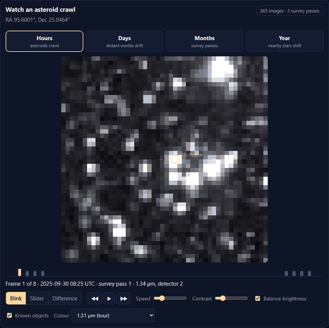
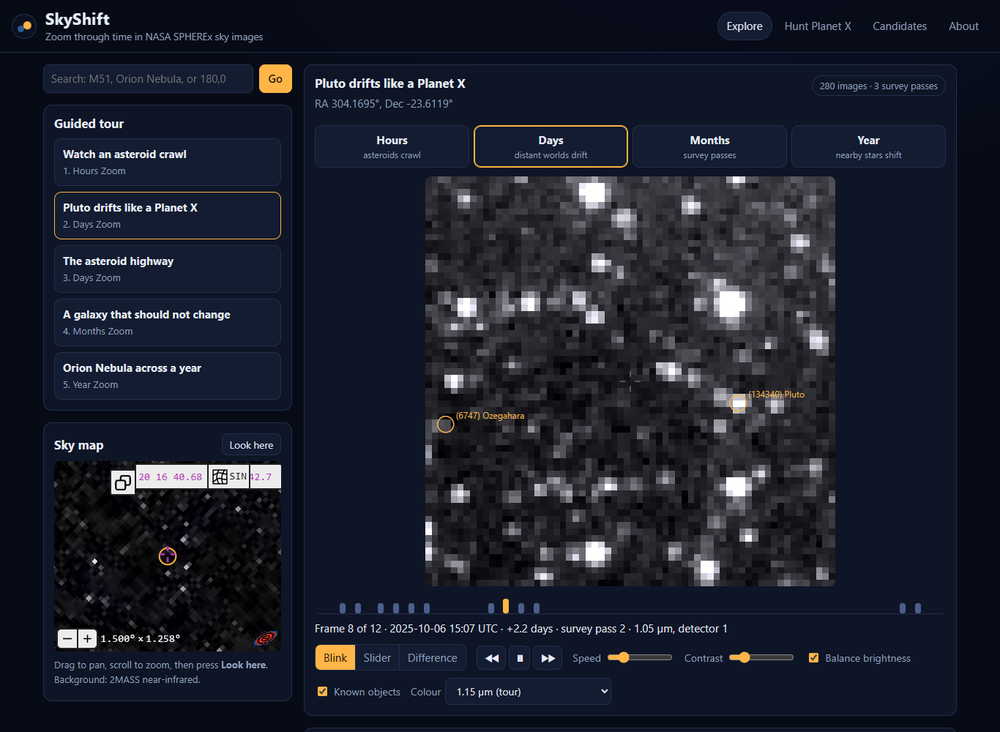

# SkyShift

[](https://doi.org/10.5281/zenodo.23181747)
[](https://github.com/Mahadi5577/skyshift/actions/workflows/ci.yml)

**Try it online: https://mahadi5577.github.io/skyshift/** (a showcase: the guided tour and Hunt
practice rounds; run it on your computer to explore the whole sky).

**Zoom through time in NASA SPHEREx sky images.** A map app lets you zoom through space;
SkyShift lets you zoom through time: hours (asteroids crawl), days (distant worlds drift),
months (whole survey passes) and a year (nearby stars shift). A "Hunt Planet X" game trains
players on planted fake movers, then lets them flag real ones on a candidate board.





Started in response to the NASA Space Apps 2026 challenge "Planet X and SPHEREx". SkyShift is an
independent project, **not affiliated with or endorsed by NASA** (see
[ACKNOWLEDGMENTS.md](ACKNOWLEDGMENTS.md)).

## Run it

Needs Python 3.11-3.13 (3.12 tested) and an internet connection.

| | Windows | macOS / Linux |
|---|---|---|
| First time (installs, ~3 min) and every time | double-click `run.bat` | `bash run.sh` |
| Before a demo: download tour + Hunt data | `run.bat precache` | `bash run.sh precache` |

Then open **http://localhost:8000**.

**Before any demo, run the precache.** On a connection far from the US servers, a fresh sky position takes 10-40 s to
download; cached ones open instantly, and Hunt mode only uses cached patches.

### Put it online
The online showcase is a static copy that GitHub Pages hosts for free:
`scripts/export_static.py` exports the tour stops (every zoom) and the Hunt patches as files, and
[`.github/workflows/pages.yml`](.github/workflows/pages.yml) rebuilds it on every push. Searching
new positions and the shared candidate board need the full server.

The [`Dockerfile`](Dockerfile) runs the full SkyShift as a public website, with per-visitor rate limits,
a cap on parallel downloads, a cache size limit and a Hunt database that survives restarts.
[docs/DEPLOY.md](docs/DEPLOY.md) covers a Hugging Face Space (needs a PRO subscription; deployed from GitHub
Actions, so nothing large is uploaded from your computer), any Docker host, and every setting.

## What's inside

```
backend/
  app.py         FastAPI routes + serves web/; start-up tasks, health check
  config.py      settings from environment variables
  spherex.py     SPHEREx search (IRSA SIA), wavelength-at-target, S3 byte-range stamp reads
  sequences.py   time-zoom frame selection, parallel download, reprojection, disk cache + pruning
  known.py       known asteroids/comets per frame (IMCCE SkyBoT)
  hunt.py        rounds with server-planted fakes, skill scores, candidate board (SQLite)
  limits.py      per-client rate limits
  precache.py    tour + Hunt downloads (scripts/precache.py, or at server start)
  backup.py      optional Hunt database backup to a Hugging Face dataset
  tour.py        guided tour stops
  wave_tables/   SPHEREx WCS-WAVE lookup tables (one per detector)
web/             single-page app (no build step): index.html, css/, js/
scripts/         precache.py, export_static.py (online showcase), release_check.py
tests/           pytest suite (offline; SKYSHIFT_NETWORK=1 adds a live IRSA test)
experiments/     standalone SPHEREx experiments behind the design + FINDINGS.md
docs/            deployment, release checklist, outreach drafts, images
deploy/          Hugging Face Space card
Dockerfile       server image
cache/           everything downloaded (safe to delete; rebuilt on demand)
data/            Hunt database (keep it)
```

### How a view is built
1. **Search:** one IRSA SIA query lists every image of the position (~5-12 s).
2. **Wavelength at the target** is computed from each image's corner polygon and the detector's
   wavelength table: no downloads, max error 0.2%.
3. **Frame choice per zoom:** Hours = the densest 24 h; Days = the richest survey pass; Months =
   median of up to 5 images per pass; Year = first and last pass. Frames match in wavelength
   (2%), except Hours, which allows 10% and balances brightness per frame.
4. **Pixels:** 256 KB byte-range reads of the IMAGE and FLAGS layers from the public S3 bucket
   (~2.6 s per frame on our ~240 ms test connection, about 0.4 s modelled in us-east-1), 8 in parallel. Bad pixels
   are filled, and each frame is reprojected onto one north-up grid.
5. The browser receives raw float32 frames and does the stretch, blink, slider and difference
   itself, so the controls respond instantly.

### API

| Method | Path | What |
|---|---|---|
| GET | `/api/resolve?q=M51` | Name or `RA,Dec` -> coordinates |
| GET | `/api/coverage?ra=&dec=` | All images, survey passes, suggested wavelength per zoom |
| POST | `/api/sequence` | `{ra, dec, zoom, wave?, n?, tol?, t_min?, t_max?}` -> frames list, starts download |
| GET | `/api/sequence/{id}` | Status per frame (`pending/loading/ready/failed`) |
| GET | `/api/sequence/{id}/frame/{i}` | Raw little-endian float32, n x n, row 0 = south |
| GET | `/api/sequence/{id}/known` | Known objects with pixel positions per frame |
| GET | `/api/tour` | Tour stops |
| GET | `/api/hunt/round?player=&key=` | New round: frame times only, never the fake's position |
| GET | `/api/hunt/round/{id}/frame/{i}` | A round's frame, fake already planted in practice rounds |
| POST | `/api/hunt/answer` | `{round_id, click: [x, y] or null}` -> result, skill, the fake's track |
| GET | `/api/hunt/board` | Real-round flags grouped and ranked |
| GET | `/api/health` | Version, downloads in progress, cache size, Hunt pool |

Interactive docs: http://localhost:8000/docs

## Evidence behind the design
From the experiments in [`experiments/`](experiments/) (all numbers in
[FINDINGS.md](experiments/FINDINGS.md)):
- **Every time scale has data:** M51 and an ecliptic field both have matching-wavelength image
  pairs from 2 minutes to over 8 months apart.
- **Hours:** asteroid (10) Hygiea moves 32″ (5 px) in 1.6 h, right where SkyBoT and JPL
  predict.
- **Days:** Pluto (~35 AU) drifts ~3 px/day across 201 SPHEREx images in Sep-Oct 2025.
- **Hunt difficulty:** planted fakes are found automatically 99.5% of the time at peak S/N 12,
  89% at 8 and 13% at 5. The game steps through S/N 12, 8, 6 and 5.

## Known limitations
- **Hunt data:** the game only uses sequences already in `cache/`. Run the precache first.
- **Bright objects** leave false-change patterns in Difference mode. They are dimmed, not
  removed.
- **Hunt is hard to cheat, not cheat-proof:** the server plants the fakes and reveals their
  track only after an answer, and a player name belongs to the browser that first used it.
  But anyone can make new names, and a determined script could rebuild the clean frames from
  the public archive and difference them. Treat the board as a list of leads to check.
- **Sky map:** the default background is the SPHEREx QR2 all-sky colour map that CDS builds
  from the six detectors. With the 2MASS background, Aladin Lite first tries IRSA's mirror,
  which blocks browser requests (CORS errors in the console), then falls back to another one.
- **Data release:** only QR2 is used (`spherex_qr2`). QR3 was still empty at test positions.

## Development

```bash
pip install -r requirements-dev.txt
pytest                         # offline tests
SKYSHIFT_NETWORK=1 pytest      # also hits the IRSA archive
```

## Citing SkyShift
Please cite the software using [CITATION.cff](CITATION.cff) (GitHub's "Cite this repository"
button), or the Zenodo archive:

> Amin, MD. Nurol (2026). *SkyShift: zoom through time in NASA SPHEREx sky images* (Version 0.1.0) [Software]. Zenodo. https://doi.org/10.5281/zenodo.23181748

Use the version DOI above for a specific release, or the concept DOI
[10.5281/zenodo.23181747](https://doi.org/10.5281/zenodo.23181747) for "the latest version". How releases are archived: [docs/ZENODO.md](docs/ZENODO.md). Papers using SPHEREx data must also include the
mission acknowledgement and dataset DOI in [ACKNOWLEDGMENTS.md](ACKNOWLEDGMENTS.md).

## Authors, AI use and licence
- Authors and contributions: [AUTHORS.md](AUTHORS.md)
- Generative-AI assistance is disclosed in [AI_USE.md](AI_USE.md)
- Licence: [BSD 3-Clause](LICENSE)
