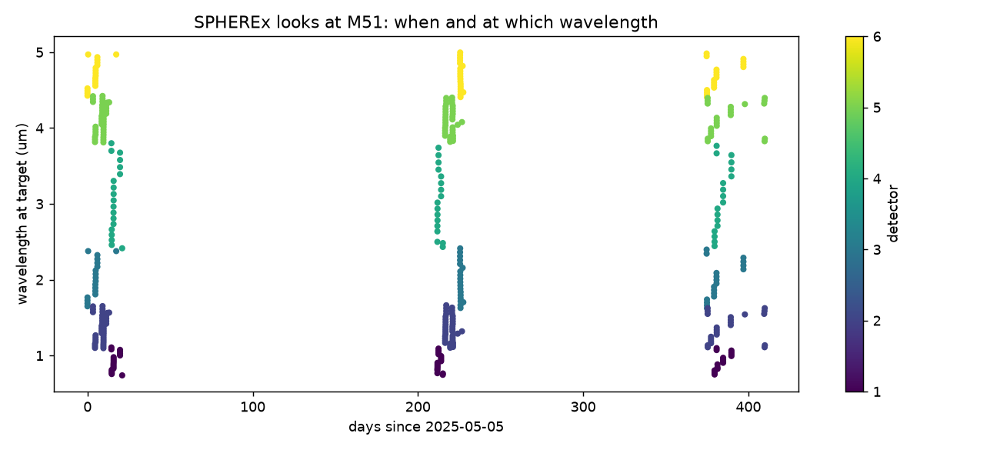
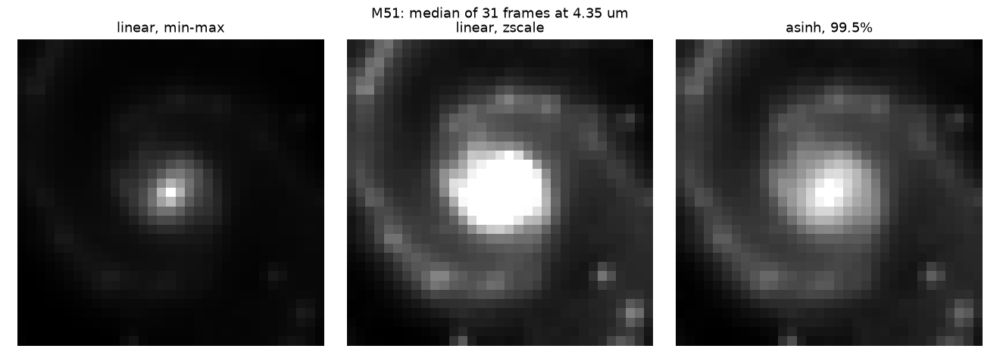
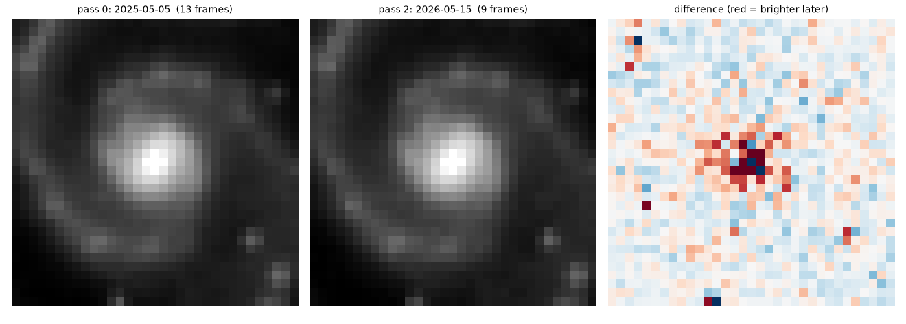
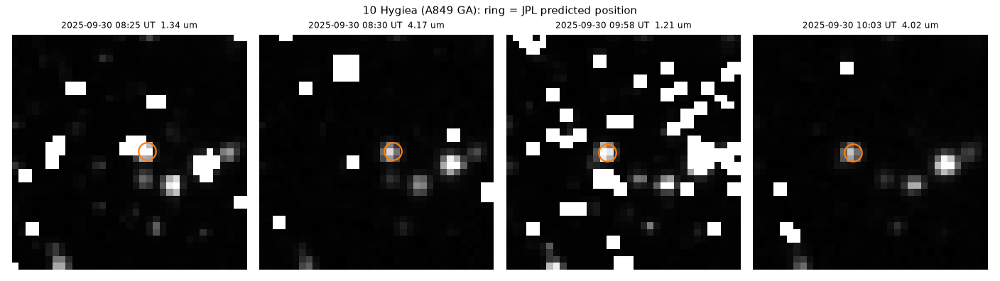
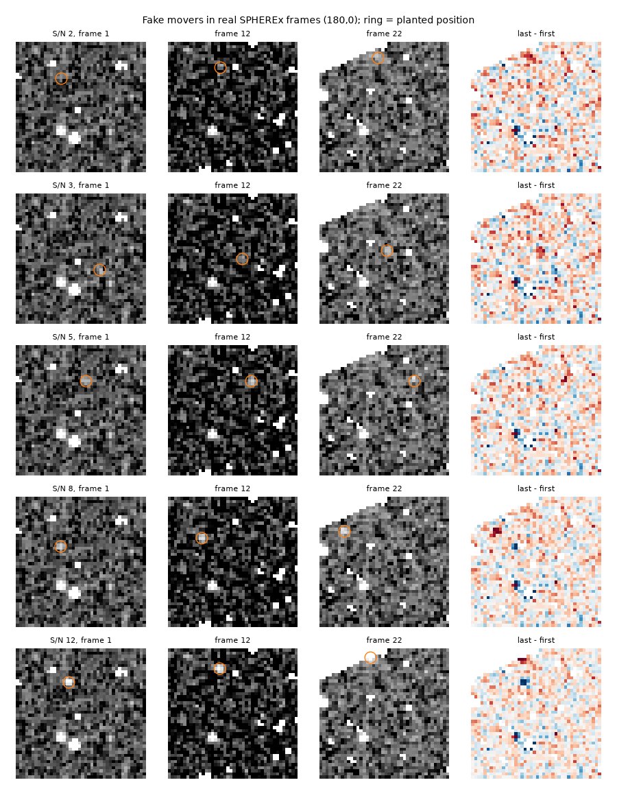

# SkyShift Sandbox: Team Guide

A hands-on introduction to NASA's SPHEREx data for our NASA Space Apps 2026 team.
Read sections 1-3 to understand the project (10 minutes), then follow section 4 to run things.

**Contents**
1. [What this is (and what it is not)](#1-what-this-is-and-what-it-is-not)
2. [The challenge and our idea: SkyShift](#2-the-challenge-and-our-idea-skyshift)
3. [SPHEREx in five minutes](#3-spherex-in-five-minutes)
4. [Setup](#4-setup)
5. [The experiments, one by one](#5-the-experiments-one-by-one)
6. [What we have learned so far](#6-what-we-have-learned-so-far)
7. [Exploration tasks for the team](#7-exploration-tasks-for-the-team)
8. [Troubleshooting](#8-troubleshooting)
9. [Rules and timeline](#9-rules-and-timeline)
10. [Glossary](#10-glossary)

---

## 1. What this is (and what it is not)

We are entering the **NASA Space Apps Challenge 2026** (hackathon on **November 14-15, 2026**)
with the challenge **"Planet X and SPHEREx"** (difficulty: Advanced; subjects: Astrophysics,
Planets & Moons, Software).

Space Apps rules say: *"Teams are not allowed to begin working on the challenges prior to the
hackathon."* So this folder is **not our project**. It is a **learning sandbox**: small Python
experiments that teach us how SPHEREx data works, what is fast, what is slow, and where the traps
are. That lets us build quickly during the 48 hours.

At the event we start a **brand-new repository** and write the app from scratch. What we carry
over is knowledge, recorded in [FINDINGS.md](FINDINGS.md), not this code.

## 2. The challenge and our idea: SkyShift

**The challenge, in short:** SPHEREx maps the whole sky every six months in 102 colours of
near-infrared light. Asteroids, comets, nearby stars, brown dwarfs and maybe unknown planets
reveal themselves by **shifting position between images**. Build a **public web tool** that shows
SPHEREx sky images and makes it **easy for anyone to see how they change over time**.

**Our idea: SkyShift.** A map app lets you zoom through *space*; SkyShift lets you zoom through
*time*. Each time scale reveals a different kind of object:

| Time-zoom setting | What moves visibly | Example rate | SPHEREx pixels moved |
|---|---|---|---|
| Hours | Main-belt asteroids (~2.5 AU) | ~36 arcsec per hour | ~6 px per hour |
| A day | Distant icy bodies (~40 AU) | ~3 arcsec per hour | ~12 px per day |
| Days to weeks | A "Planet X" (~500 AU) | ~7 arcsec per day | ~1 px per day |
| Months to a year | Fast nearby stars | ~10 arcsec per year | ~1.7 px per year |

The simple rule the public learns: **the slower it moves, the farther away it is.**

SkyShift has three parts, in build priority order:
1. **Time-zoom blink viewer (the core, meets the challenge on its own).** Search a sky position,
   pick a time scale, and watch a flipbook, a before/after slider or a difference image.
   Known asteroids get labels.
2. **"Hunt Planet X" game.** Players practise on sky patches with clearly labelled, planted fake
   movers, get a skill score, then flag real unexplained movers. Votes are weighted by skill, so
   the candidate list is something scientists could trust.
3. **Spectrum card (if time allows).** Click an object to see its SPHEREx spectrum with a
   plain-language guess ("reflected sunlight, probably an asteroid").

Honesty note for the pitch: a real distant Planet X is probably too faint for SPHEREx. The game
teaches the *method*. Real catches would be asteroids, comets, distant solar-system bodies and
nearby stars.

## 3. SPHEREx in five minutes

**The telescope.** SPHEREx is a NASA space telescope launched in March 2025 into a low Earth
orbit. It photographs the whole sky roughly every six months in near-infrared light from
0.75 to 5 micrometres (um), which is just beyond what our eyes see.

**Six detectors.** Six detectors (D1-D6) expose at once. They work in pairs that see the same
patch of sky through a beam splitter (D1+D4, D2+D5, D3+D6), so each spot is photographed at two
wavelengths simultaneously. Each detector covers part of the range: D1 ~0.75-1.1 um up to
D6 ~4.4-5 um.
Each image is 2040 x 2040 pixels and each pixel covers **6.15 arcseconds**, so the full Moon
would span about 300 pixels. That is coarse: small motions are hard to see.

**The filter trap (most important concept).** SPHEREx has no ordinary colour filters. Each
detector sits behind a *linear variable filter*: **the wavelength changes from one edge of the
image to the other.** So the "colour" a star is seen in depends on *where on the detector* it
lands. Two images of the same spot are usually taken at **different wavelengths**, and a star can
look brighter or fainter just because of the wavelength, without moving or changing at all.
**Rule: only compare images taken at a matching wavelength** when judging change.

**Survey passes.** SPHEREx sweeps over a given spot for about 2-3 weeks, then leaves for about
six months. During a pass it photographs the spot many times: minutes, hours and days apart,
with the wavelength stepping along as the spot slides across the filter. Our M51 test found
three passes so far: May 2025, December 2025 and May-June 2026.

**What is inside one image file** (a FITS file with several layers):

| Layer | What it holds | How we use it |
|---|---|---|
| IMAGE | Sky brightness in MJy/sr | The picture |
| FLAGS | Per-pixel bad-pixel and processing bits | Hide broken pixels |
| VARIANCE | Noise estimate per pixel | Error bars |
| ZODI | Model of glow from interplanetary dust | Subtract it for a cleaner image |
| PSF | How a point of light is blurred (5 MB!) | Not needed for display |
| WCS-WAVE | Lookup table: pixel position -> wavelength | Find the wavelength at our target |

**Where the data lives.**
- **IRSA** (NASA/IPAC Infrared Science Archive at Caltech) runs the search service (SIA): "which
  images cover this position?"
- The **same files sit in a public Amazon S3 bucket**, `nasa-irsa-spherex`. It's free, with no
  account needed. Reading small pieces from S3 is far faster than IRSA's cutout service.
- Current data release: **QR2** (collection name `spherex_qr2`).

## 4. Setup

**You need:** Python **3.11-3.13** (3.12 tested), about 600 MB of free disk space, and an
internet connection. Git is not needed.

**Install Python if you don't have it:** download 3.12 from https://www.python.org/downloads/.
On Windows, **tick "Add python.exe to PATH"** in the installer. On macOS you can also use
`brew install python@3.12`.

### Windows
1. Get the files: clone the SkyShift repository and open its `experiments` folder (or unzip the
   team's `skyshift-sandbox.zip`).
2. Double-click **`setup.bat`**. It creates a private Python environment (`.venv`), installs the
   packages (2-5 minutes) and runs the setup check.
3. Run experiments from a terminal opened in that folder:
   ```
   .venv\Scripts\python 03_blink.py M51
   ```
   (Or activate the environment first with `.venv\Scripts\activate`, then just `python ...`.)

### macOS / Linux
1. Unzip, then open a terminal in the folder.
2. Run:
   ```bash
   bash setup.sh
   source .venv/bin/activate
   python 03_blink.py M51
   ```

### Check it worked
`setup` runs `00_check.py` for you. You can re-run it any time with `python 00_check.py`.
Every line should say `OK`:

```
  OK    packages installed             5.7s  astropy 8.0.1, numpy 2.5.3
  OK    IRSA image search (SIA)        7.3s  413 SPHEREx images at M51
  OK    S3 header read (32 KB)         3.2s  EXTNAME=IMAGE
  OK    S3 stamp read                 10.1s  8x8 px stamp
  OK    name resolver (CDS Sesame)     0.0s  M51 -> 202.470, 47.195
  OK    JPL Horizons                   0.2s  10 Hygiea (A849 GA) V=11.0
```

## 5. The experiments, one by one

Run them in order the first time. Each one answers one question. Outputs go to
`data/<target>/`. The repository ships no data: run `01_epochs.py` and `02_stamps.py` for a
target before `03_blink.py` (the team zip includes M51 data, so there experiment 3 works offline).

**Targets** can be a name (`M51`, `"Orion Nebula"`, `Vega`, looked up online via CDS Sesame)
or coordinates in degrees as `"RA,Dec"`, e.g. `"180,0"`.

Times below were measured on a connection ~240 ms round trip from the US servers. Closer to
the US they are faster.

---

### `00_check.py`: can my machine run this? (~30 s)
Checks packages and every online service the experiments use. Run it first whenever something
breaks.

---

### `01_epochs.py`: when, and at which wavelengths, did SPHEREx look at this spot? (~2 min)

```
python 01_epochs.py M51
```

**What it does:** asks IRSA for every image covering the target, then works out the exact
wavelength at the target in each image. It does this from a 32 KB piece of each file, not the
whole ~70 MB file.

**Output, and how to read it:**
- Console: the list of **survey passes**, then a table of **image pairs at matching wavelength,
  by time gap**. A non-zero count in a row means that time-zoom level is possible here.
  ```
  Pairs at matching wavelength (within 2%), by time gap:
    < 1 hour           157
    1 hour - 1 day      68
    1 - 30 days        388
    1 - 8 months      1252
    > 8 months         544
  ```
- `epochs.png`: every image as a dot, with time across and wavelength up. You can see the three
  passes and the wavelength climbing within each pass (the filter trap in action).
- `index.csv`: one row per image (time, detector, wavelength at target, file key).



**Options:** `--collection spherex_qr3` (newer release, partial so far), `--tol 0.01` (stricter
wavelength match).

---

### `02_stamps.py`: download small matching images (~1 min)

```
python 02_stamps.py M51
python 02_stamps.py M51 --wave 1.65    # force a wavelength in um
```

**What it does:** picks the wavelength seen in the most survey passes (or yours with `--wave`).
It then downloads a small square ("stamp") around the target from every image at that wavelength,
with the dust glow subtracted. It reads only the needed bytes from S3, about 6 s per stamp
instead of 37 s via IRSA cutouts.

**Output:** `data/<target>/stamps/*.fits` and `stamps.csv`. Already-downloaded stamps are skipped,
so re-running is cheap.

**Options:** `--half 40` (bigger stamp, in pixels), `--workers 4` (fewer parallel downloads on
weak connections).

---

### `03_blink.py`: blink, compare and stretch (seconds)

```
python 03_blink.py M51
```

**What it does:** puts every stamp on one common north-up grid (each pass is rotated differently),
then makes:

| File | What it shows |
|---|---|
| `stretches.png` | The same image under 3 contrast settings: which reads best for the public? |
| `blink_frames.gif` | Every exposure in time order (the hours/days time-zoom) |
| `blink_passes.gif` | One combined frame per survey pass (the months time-zoom) |
| `difference.png` | Last pass minus first pass. Red = brighter later, blue = fainter later |





**Lesson in the difference image:** M51 is a galaxy and does not change, yet its bright core
leaves a strong red/blue residual. That's a *false change* caused by slightly different blurring
between passes. SkyShift must handle this, or users will "discover" fake changes.

> Tip: GIFs may not animate in the VS Code preview. Open them in a web browser.

---

### `04_asteroid.py`: catch a known asteroid moving (~10-15 min)

```
python 04_asteroid.py 10                                          # (10) Hygiea
python 04_asteroid.py 10 --start 2025-09-25 --stop 2025-10-05     # much faster: narrow dates
python 04_asteroid.py 433                                         # (433) Eros
```

**What it does:** gets the asteroid's predicted path from NASA JPL Horizons. It searches SPHEREx
images near each day's position, confirms which images really contain it, then animates a fixed
patch of sky. The stars stay put; the asteroid should walk across. An orange ring marks where JPL
predicts it.

**Output:** `data/ast_<id>/asteroid.gif`, `asteroid_panels.png`, `hits.csv` (every image
containing the asteroid).



Hygiea moves 32 arcsec (5 pixels) in 1.6 hours, right on the predicted ring. **This proves the
hours level of time-zoom on real data.** White squares are masked bad pixels (see FINDINGS.md
for why this needs a better fix).

**Speed tip:** the slow part is one search per day over the whole date range. Once `hits.csv`
shows when the asteroid was observed, re-run with `--start/--stop` around those dates.

---

### `05_aladin.html`: sky-browser test (untested)

Open the file in a web browser (double-click it). It uses **Aladin Lite v3**, the sky viewer that
may become SkyShift's front page:
- Type a target and press **Go**; drag to pan, scroll to zoom.
- Switch the background survey (2MASS is closest to SPHEREx's wavelengths).
- Click the orange marker for a popup.
- **Experiment:** use "Overlay a stamp FITS" to pick a file from `data/M51/stamps/`. Does it
  appear in the right place? Record the answer in FINDINGS.md.

---

### `06_speed.py`: how fast would SkyShift be next to the data? (~2 min)

```
python 06_speed.py
```

We can't test on a US server, so this splits delays into distance-dependent parts (round trip,
bandwidth) and fixed parts (S3 processing time, number of requests, bytes). It then predicts
the speed for a server in AWS us-east-1. **Run it on your own network and add your numbers to
FINDINGS.md.** Our result on that connection: a 30-frame flipbook takes ~10 s from here,
~1.5 s modelled in us-east-1, and under 0.5 s from pre-rendered files.

---

### `07_inject.py`: plant fake movers (seconds)

```
python 07_inject.py "180,0"      # needs 01 + 02 for the same target first
```

Plants moving point sources at several brightness levels into real frames, then measures how
often a matched filter finds them, plus panels for judging by eye. Result on the ecliptic field:
found 99.5% of the time at peak S/N 12, 89% at S/N 8 and 13% at S/N 5.



---

### `spx.py`: shared helpers (read this if you write Python)
Not run directly. It contains the reusable tricks: fast search over plain HTTP, the 32 KB header
read, the wavelength lookup, S3 stamp reads, flag decoding and retries for flaky connections.
Each function has a one-line description.

## 6. What we have learned so far

Full details with numbers are in **[FINDINGS.md](FINDINGS.md)**. The headlines:

1. **Every time-zoom level has data:** at M51 there are matching-wavelength image pairs from
   2 minutes to over 8 months apart.
2. **Hours-scale motion is real and visible:** Hygiea moves 5 pixels in 1.6 hours, exactly where
   NASA JPL predicts.
3. **Speed is the main engineering problem, and caching solves it.** On our test connection a stamp
   takes ~2.6 s (IRSA cutouts ~37 s); modelled next to the data ~0.4 s. Pre-rendered files are
   fast anywhere, so featured targets get cached and live search streams frames as they arrive.
4. **The filter trap is real:** search results report a detector's whole wavelength range, not
   the wavelength at your target. We compute it from a lookup table that is the same for every
   image from a given detector.
5. **False changes exist:** rotation between passes (fixed by reprojecting) and bright cores
   (still open).
6. **Bad-pixel flags need care:** one flag hid part of a bright asteroid.

## 7. Exploration tasks for the team

Pick one, put your name on it in the team chat, and log the result in FINDINGS.md. These are
learning tasks, allowed before the event.

- [ ] **Ecliptic check:** run `01_epochs.py "180,0"` and a high-latitude target such as
      `"270,66"` (near the north ecliptic pole). How do passes and gaps differ from M51?
- [ ] **Fainter asteroids:** try `04_asteroid.py` with fainter numbered asteroids. At what
      brightness (the V magnitude printed at the start) does the asteroid disappear into noise?
- [ ] **Aladin Lite:** test `05_aladin.html`, including the FITS overlay. Find out whether IRSA
      offers a SPHEREx HiPS (tiled all-sky map).
- [ ] **SOURCE flag:** do known asteroids always carry FLAGS bit 21? Compare asteroid frames with
      empty sky.
- [ ] **Nicer display:** try different bad-pixel masks and fill-in methods so frames have no
      white holes.
- [ ] **Speed on your network:** time `00_check.py` and `02_stamps.py` and note your location.
- [ ] **Learn the ecosystem:** the IRSA SPHEREx tutorial notebooks
      (https://caltech-ipac.github.io/irsa-tutorials/spherex) and 30 minutes as a volunteer on
      *Backyard Worlds: Planet 9* (the closest existing project to ours).

## 8. Troubleshooting

| Problem | Fix |
|---|---|
| `python` not found | Install Python 3.12 (section 4). On Windows try `py -3.12`; on macOS `python3.12`. |
| Package install fails (often numpy or astropy) | Your Python is too old or too new. Use 3.12. Last resort: `pip install astropy astroquery pyvo numpy matplotlib reproject requests s3fs fsspec` without version pins. |
| Don't run `pip install --upgrade pip` inside `.venv` on Windows | It broke on a file lock during testing. If you did, delete `.venv` and run setup again. |
| PowerShell refuses `.venv\Scripts\activate` | Skip activation and call `.venv\Scripts\python script.py` directly. |
| `FAIL ... ConnectionError` or timeouts | Long-distance links drop connections; the code retries 4 times. Re-run, or use fewer parallel downloads with `--workers 3`. Some university or office networks block S3: try another network or a phone hotspot. |
| `SSL: CERTIFICATE_VERIFY_FAILED` | Usually a network that intercepts HTTPS. Try another network. |
| Name lookup fails (`M51` not found) | Use coordinates instead: `python 01_epochs.py "202.4696,47.1952"`. |
| `no coverage; try another --collection` | Check the coordinates; use the default `spherex_qr2`. QR3 is still filling in. |
| `FileNotFoundError: index.csv` | Run the steps in order: 01, then 02, then 03 for the same target. |
| GIF does not animate | Open it in a web browser. |
| `04_asteroid.py` is slow | Expected (one search per day). Narrow `--start/--stop`. |

## 9. Rules and timeline

| Date (2026) | What |
|---|---|
| Now - Oct 27 | Learn, explore, form the team (max 6 people, same local event) |
| **Oct 28** | Full challenge statement and datasets released. Re-check SkyShift against it |
| Nov 13 | Submission and judging guides released. Check the rules on AI tools and reusing code |
| **Nov 14-15** | Hackathon: start the SkyShift repo from zero and build |

Until Nov 14: **learning only, no SkyShift code.** Using open-source libraries (astropy, Aladin
Lite, etc.) at the event is normal, but confirm in the Nov 13 guides.

## 10. Glossary

| Term | Meaning |
|---|---|
| **arcsec** | 1/3600 of a degree. The full Moon is about 1800 arcsec across. One SPHEREx pixel = 6.15 arcsec. |
| **AU** | Astronomical unit, the Earth-Sun distance (~150 million km). |
| **um (micrometre)** | Wavelength unit. Human eyes see 0.4-0.7 um; SPHEREx sees 0.75-5 um. |
| **RA / Dec** | Sky coordinates, like longitude/latitude on the sky, in degrees. |
| **Ecliptic** | The plane the planets orbit in. Most asteroids are near it. |
| **FITS** | The standard file format for astronomy images; can hold several layers. |
| **WCS** | The mapping inside a FITS file from pixel (x, y) to sky position (and, for SPHEREx, wavelength). |
| **LVF** | Linear variable filter: wavelength changes across the detector (the "filter trap"). |
| **MJD** | Modified Julian Date, a day count astronomers use for time. |
| **MJy/sr** | Brightness unit of the images (surface brightness). |
| **Zodi** | Zodiacal light: glow from interplanetary dust, subtracted before display. |
| **PSF** | Point spread function: how the telescope blurs a point of light. |
| **SIA** | Simple Image Access, a standard web API for "which images cover this spot?" |
| **S3** | Amazon's file storage. SPHEREx files are public there. |
| **Stamp** | A small square cut out of a big image around a target. |
| **Reproject** | Resample an image onto another pixel grid, so different images line up. |
| **Stretch** | How pixel values map to screen brightness (linear, asinh...). |
| **Difference image** | One image minus another: unchanged things cancel, changes stand out. |
| **Survey pass** | One ~2-3 week sweep of SPHEREx over a spot; repeats about every 6 months. |
| **HiPS** | Tiled all-sky image format that Aladin Lite displays, like map tiles for the sky. |
| **Aladin Lite** | A JavaScript sky viewer from CDS Strasbourg, the "Google Maps of the sky". |
| **JPL Horizons** | NASA service giving positions of solar-system objects at any time. |
| **QR2 / QR3** | SPHEREx Quick Release versions. QR2 is complete; QR3 is newer and partial. |
